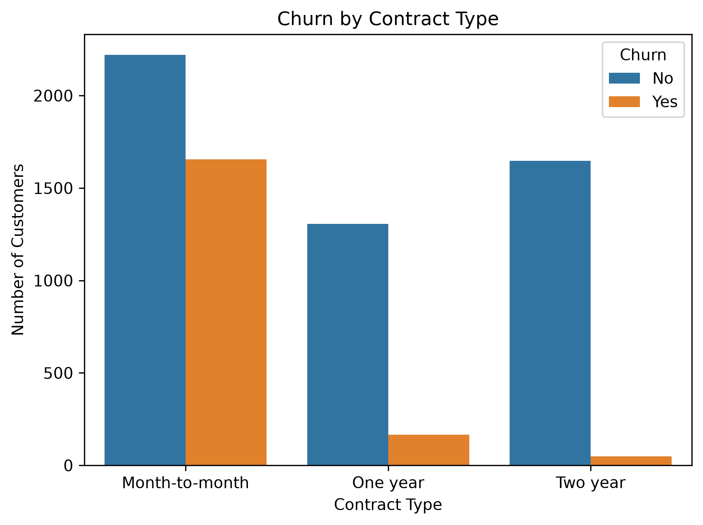
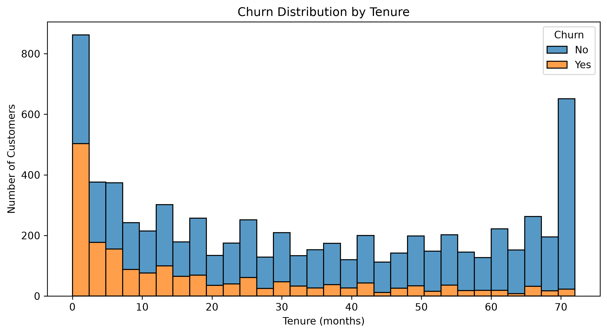
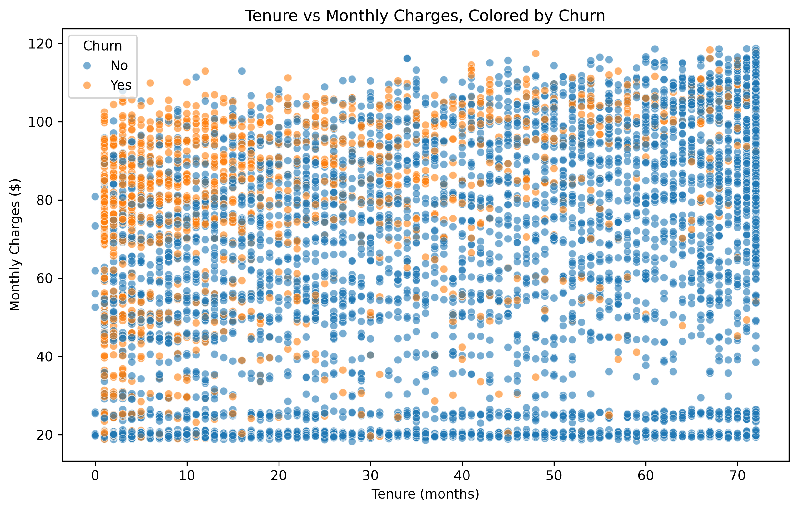
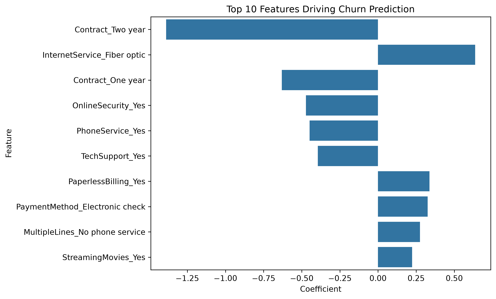

<div align="center">

# 📊 Customer Churn Analysis
### A Data-Driven Framework for Predicting and Preventing Customer Attrition


*An end-to-end analytics project: from raw data to a deployed predictive model and business strategy.*

</div>

---

## 📑 Table of Contents

- [Problem Statement](#-problem-statement)
- [Executive Summary](#-executive-summary)
- [Dataset](#-dataset)
- [Methodology](#-methodology)
- [Key Findings](#-key-findings)
- [Predictive Modeling](#-predictive-modeling)
- [Business Recommendations](#-business-recommendations)
- [Visuals](#-visuals)
- [Tech Stack](#️-tech-stack)
- [Project Structure](#-project-structure)
- [How to Run](#️-how-to-run)
- [Limitations & Future Work](#-limitations--future-work)
- [About the Author](#-about-the-author)

---

## 🎯 Problem Statement

Customer acquisition costs 5–25x more than retention, yet most businesses only react to churn
*after* a customer has already left. This project reframes churn as a problem that can be
anticipated, not just measured — using historical customer data to identify **who is at risk,
why, and what intervention is likely to work.**

**Business question:** *Which customers are most likely to churn, and what can the company do
to retain them before they leave?*

---

## 📌 Executive Summary

| | |
|---|---|
| 🔑 **Primary Driver** | Contract type is the single strongest predictor of churn — month-to-month customers churn at **15x** the rate of two-year contract holders |
| ⏳ **Highest-Risk Window** | Customer attrition is heavily concentrated in the **first 3 months** of the relationship |
| 🤖 **Model Deployed** | Class-weighted Random Forest — **65.4% recall**, correctly flagging 2 in 3 customers who will actually churn |
| 💰 **Actionable Impact** | Of 373 churners in the holdout test set, the model surfaces **244** for proactive retention outreach |
| ✅ **Strategic Response** | Five prioritized, data-backed recommendations — see [Business Recommendations](#-business-recommendations) |

---

## 📊 Dataset

**Source:** [Telco Customer Churn](https://www.kaggle.com/datasets/blastchar/telco-customer-churn) (IBM sample dataset, via Kaggle)
**Scope:** 7,043 customers · 21 raw features · Binary target (`Churn`: Yes/No)
**Feature categories:** Demographics, account tenure & billing, subscribed services, contract terms

---

## 🔬 Methodology

This project follows a structured, six-stage analytical workflow:

1. **Data Cleaning** — Resolved a latent type error in `TotalCharges` (stored as text due to
   blank values in new-customer records), removed non-predictive identifiers, and validated
   data integrity (nulls, duplicates).
2. **Exploratory Data Analysis** — Investigated churn behavior across contract type, tenure,
   pricing, and service type to surface primary drivers.
3. **Risk Segmentation** — Built a rule-based scoring system (informed directly by EDA
   findings) to bucket customers into High / Medium / Low churn-risk tiers, validated against
   actual churn outcomes.
4. **Predictive Modeling** — Trained and benchmarked Logistic Regression against Random
   Forest (default and class-weighted variants), selecting the final model based on business
   cost of false negatives, not accuracy alone.
5. **Business Translation** — Converted statistical findings into prioritized, actionable
   retention strategies.
6. **Dashboarding** — Exported model outputs into Power BI for stakeholder-facing,
   self-serve exploration.

---

## 🔑 Key Findings

| # | Finding | Evidence |
|---|---|---|
| 1 | **Contract type is the dominant churn driver** | Month-to-month: 42.7% churn · One-year: 11.3% · Two-year: 2.8% |
| 2 | **Churn risk is front-loaded** | Attrition is concentrated in tenure 0–3 months, dropping sharply thereafter |
| 3 | **Premium pricing does not guarantee loyalty** | Fiber optic customers churn 2x+ more than DSL customers despite paying a premium |
| 4 | **Add-on services correlate with retention** | Customers with Online Security / Tech Support churn less — likely reflecting deeper product engagement |
| 5 | **Segmentation is statistically validated** | High-risk segment: 51.7% actual churn vs. 3.6% for Low-risk — a 14x separation |

---

## 🤖 Predictive Modeling

Three model configurations were trained and evaluated on an identical, held-out 20% test
set to ensure a fair comparison.

| Model | Accuracy | Precision | Recall | F1 |
|---|---|---|---|---|
| Logistic Regression | 82.2% | 68.7% | 60.1% | 64.1% |
| Random Forest (default) | 78.5% | 63.7% | 43.7% | 51.8% |
| **Random Forest (`class_weight='balanced'`)** ✅ | 78.9% | 59.2% | **65.4%** | 62.2% |

**Model selection rationale:** Accuracy is a misleading metric here — the dataset is
imbalanced (~73% retained / 27% churned), so a naive model could score ~73% accuracy while
catching zero churners. **Recall was prioritized** as the deciding metric, since the cost of
a missed churner (lost customer, lost revenue) materially outweighs the cost of a false
positive (an unnecessary retention offer). The class-weighted Random Forest was selected as
the production model on this basis.

**Top predictive features** (via Logistic Regression coefficients) independently validated
the EDA findings: `Contract_Two year` and `InternetService_Fiber optic` emerged as the two
strongest signals in the model — confirming that manual analysis and machine learning
converged on the same conclusions.

---

## 💡 Business Recommendations

| Priority | Recommendation | Rationale |
|---|---|---|
| 1 | Incentivize conversion from month-to-month to annual contracts | Strongest single lever; 15x churn differential |
| 2 | Implement structured onboarding touchpoints at day 30 / day 60 | Churn is concentrated in the first 3 months |
| 3 | Audit the Fiber optic customer experience (pricing, reliability, support) | 2x+ churn despite premium pricing signals a value gap |
| 4 | Bundle Online Security / Tech Support into new month-to-month plans | Correlated with materially lower churn |
| 5 | Operationalize the churn model as a monthly scoring pipeline | Shifts retention from reactive to proactive |

---

## 📈 Visuals

<p align="center">
  
  
</p>
<p align="center">
  
  
</p>

An interactive Power BI dashboard extending these visuals is available in [`/dashboard`](./dashboard) *(link/screenshot to be added)*.

---

## 🛠️ Tech Stack

| Category | Tools |
|---|---|
| Language | Python 3.x |
| Data Wrangling | Pandas, NumPy |
| Visualization | Matplotlib, Seaborn |
| Machine Learning | Scikit-learn (Logistic Regression, Random Forest) |
| Dashboarding | Power BI |
| Environment | Jupyter Notebook |

---

## 📂 Project Structure

```
customer-churn-analysis/
├── data/
│   ├── WA_Fn-UseC_-Telco-Customer-Churn.csv      # Raw dataset
│   └── telco_churn_with_segments.csv             # Cleaned dataset with risk segments (Power BI source)
├── notebooks/
│   └── customer-churn-analysis.ipynb             # Full analysis: cleaning → EDA → modeling
├── outputs/
│   ├── churn_by_contract.png
│   ├── churn_by_tenure.png
│   ├── risk_segment_scatter.png
│   └── feature_importance.png
├── requirements.txt
└── README.md
```

---

## ▶️ How to Run

```bash
# 1. Clone the repository
git clone https://github.com/Nilesh-builds/customer-churn-analysis.git
cd customer-churn-analysis

# 2. Install dependencies
pip install -r requirements.txt

# 3. Launch the notebook
jupyter notebook notebooks/customer-churn-analysis.ipynb
```

---

## 🔭 Limitations & Future Work

- **Class imbalance** (~27% churn) constrains precision when optimizing for recall; techniques such as SMOTE or threshold tuning could be explored to improve the precision-recall trade-off.
- **Static snapshot data** — the model reflects a single point in time; a production deployment would require periodic retraining as customer behavior shifts.
- **No causal inference** — findings (e.g., Fiber optic churn, billing method correlation) are associative, not causal; qualitative research (support tickets, surveys) would strengthen root-cause conclusions.
- **Next iteration:** incorporate customer lifetime value (CLV) into risk scoring, so retention spend can be prioritized by *both* churn probability and revenue impact.

---

## 🙋 About the Author

**Nilesh** — Data Science undergraduate (BCA, Data Science specialization) building
end-to-end analytics projects as part of a Data Analyst job search.

📫 [LinkedIn](https://www.linkedin.com/in/nilesh-singh-b9b6932bb) · 💻 [GitHub](https://github.com/Nilesh-builds) · ✉️ [Email](kumarnilash509@gmail.com)