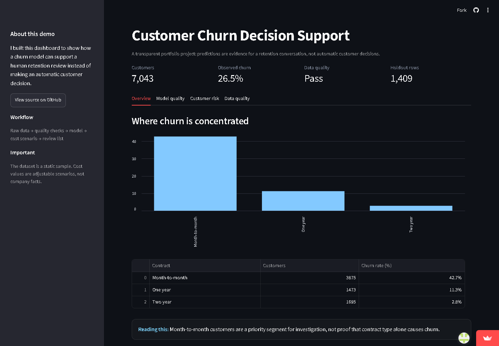

# Customer Churn Analysis

An end-to-end customer churn analysis that moves from raw CSV data to SQL
business analysis, leakage-safe modeling, cost-sensitive review thresholds,
and an interactive Streamlit decision-support tool.

**Live demo:** [Customer Churn Decision Support](https://nilesh-customer-churn.streamlit.app/)

I built this project around a question a retention team could actually use:
**which customers look most at risk of leaving, and who should be reviewed
first?** I did not want to choose a model because it had the best accuracy.
Churn is an imbalanced problem, and the cost of missing a likely churner can
be different from the cost of contacting someone who would have stayed.

## What the project includes

- Raw-data quality profiling and schema checks
- Cleaning and reproducible feature preparation
- SQLite analytics database with reusable views
- SQL churn and retention queries
- Logistic Regression and Random Forest baselines
- Stratified holdout evaluation and five-fold cross-validation
- ROC-AUC, PR-AUC, calibration, precision, recall, and F1
- Cost-sensitive outreach threshold scenarios
- Streamlit customer-risk review dashboard
- Automated tests and GitHub Actions
- Architecture, data dictionary, model card, and responsible-use notes

## Project story

The first issue I found was `TotalCharges`. It looks numeric, but the source
file stores it as text and leaves it blank for some new customers. I convert
it to a number and treat those blanks as zero because a new customer has not
accumulated charges yet. I also remove `customerID` before modeling because it
identifies a row rather than describing customer behavior.

The original notebook is still included because it shows the exploratory path
and the reasoning behind the first version of the project. The reusable
`src/churn_analysis` package is the more reliable path: it can be tested,
executed from the command line, and used by the dashboard.

## Architecture

```text
raw CSV
  -> quality profile
  -> cleaning
  -> SQLite analytics views
  -> leakage-safe preprocessing
  -> model evaluation
  -> cost scenarios
  -> human review dashboard
```

More detail is in [`docs/architecture.md`](docs/architecture.md).

## Results

The current baseline pipeline reports metrics from a stratified holdout split
and five-fold cross-validation. Run the pipeline to generate the exact report
for the current code and data:

```bash
python -m pip install -r requirements.txt
python -m pip install -e .
python -m churn_analysis.pipeline
```

The command writes:

- `outputs/metrics/model_metrics.json`
- `data/churn_analysis.db`

The SQLite database is generated locally and ignored by Git. The metrics JSON
is committed as a small, reviewable evaluation snapshot so the hosted demo can
show verified results without consuming its limited startup resources.

The balanced Random Forest is retained as a useful baseline because it finds
more churners than the unweighted Random Forest in the holdout evaluation.
That does not automatically make it the right production model. The dashboard
lets the reviewer change contact and missed-churn costs instead of hiding those
assumptions inside a hard-coded threshold.

## Run the dashboard

```bash
streamlit run app/streamlit_app.py
```

The dashboard contains:

- Contract-level churn overview
- Cross-validated model metrics
- Cost-sensitive threshold scenarios
- A ranked customer review list
- CSV download for the review list
- Data-quality report

The dashboard is decision support. It does not automatically contact,
penalize, cancel, or reject customers.

### Dashboard preview



The live demo contains additional model-quality, customer-risk, and data-quality
views.

## Run the notebook

```bash
jupyter notebook notebooks/customer-churn-analysis.ipynb
```

## Run tests

```bash
python -m pytest
```

## Repository structure

```text
customer-churn-analysis/
├── app/
│   └── streamlit_app.py
├── data/
│   ├── WA_Fn-UseC_-Telco-Customer-Churn.csv
│   └── telco_churn_with_segments.csv
├── docs/
│   ├── architecture.md
│   ├── data-dictionary.md
│   └── model-card.md
├── notebooks/
│   └── customer-churn-analysis.ipynb
├── outputs/
│   ├── churn_by_contract.png
│   ├── churn_by_tenure.png
│   ├── feature_importance.png
│   └── risk_segment_scatter.png
├── sql/
│   ├── analytics.sql
│   └── schema.sql
├── src/churn_analysis/
│   ├── data.py
│   ├── database.py
│   ├── modeling.py
│   └── pipeline.py
├── tests/
├── pyproject.toml
└── requirements.txt
```

## Limitations and responsible use

- The source data is a static IBM sample, not a live customer feed.
- There is no timestamp, so temporal drift and future-data validation cannot
  be measured honestly.
- Observed relationships are correlations, not causal explanations.
- Cost values in the dashboard are scenarios, not measured company costs.
- A real deployment would need intervention experiments, governance, privacy
  review, and monitoring by customer segment.
- The model should create a review queue, not make an automatic customer
  decision.

The full intended use and limitations are documented in
[`docs/model-card.md`](docs/model-card.md).

## Source and license

The data is the IBM Telco Customer Churn sample dataset distributed through
Kaggle. Check the dataset terms before redistributing it. Code in this
repository is available under the MIT License.

## About me

I am Nilesh Singh, a BCA Data Science student building toward Data Analyst and
AI Trainer roles. I am interested in the part of analytics that happens after
the model: checking whether the result is trustworthy, explaining it clearly,
and turning it into a decision someone can act on.

- [LinkedIn](https://www.linkedin.com/in/nilesh-singh-b9b6932bb)
- [GitHub](https://github.com/Nilesh-builds)
