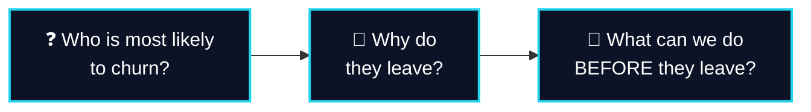
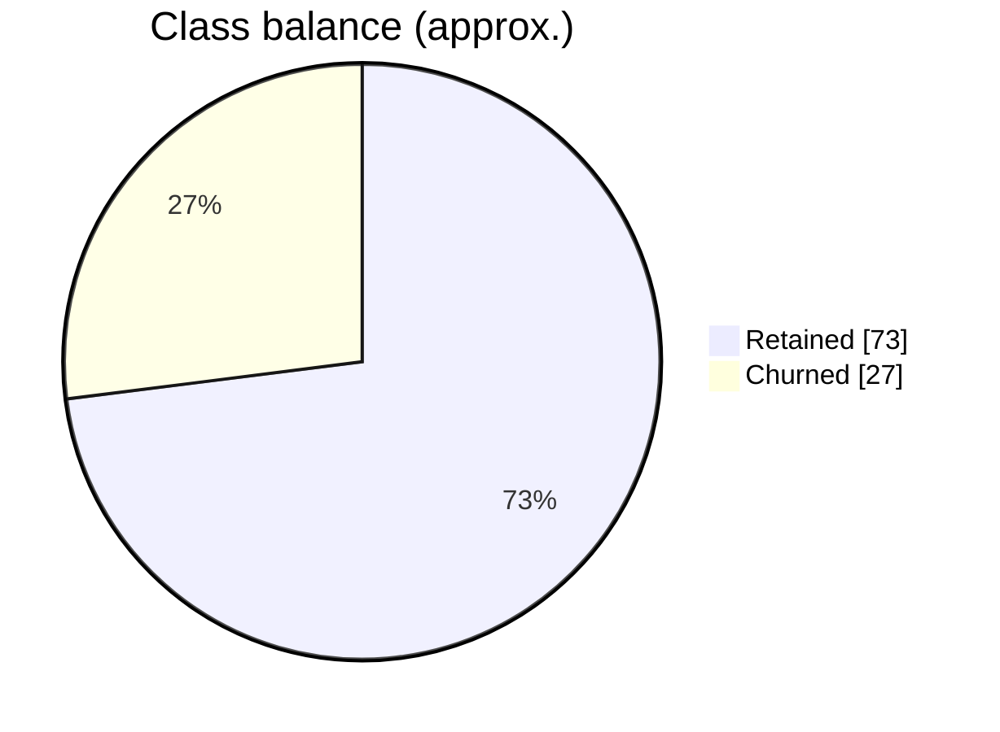
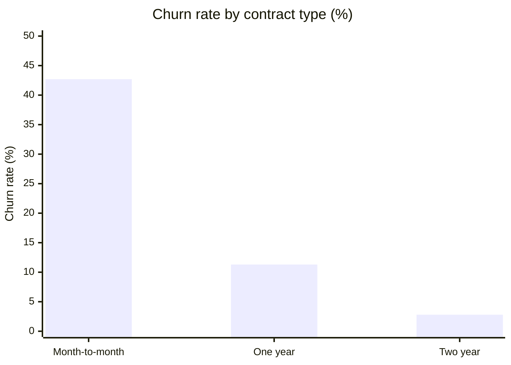
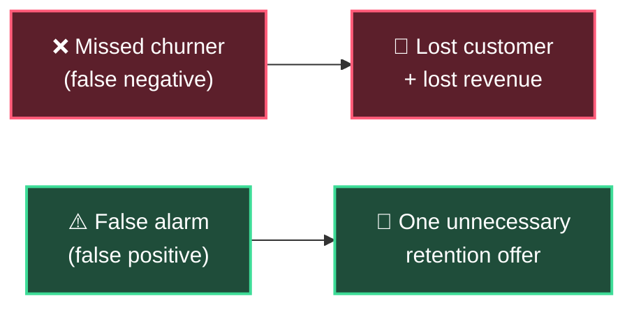
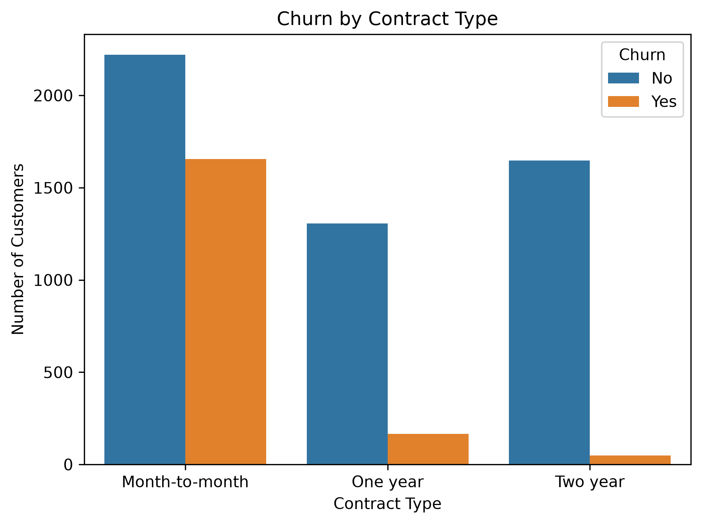
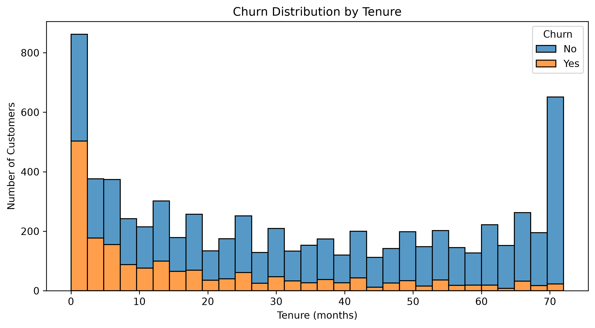
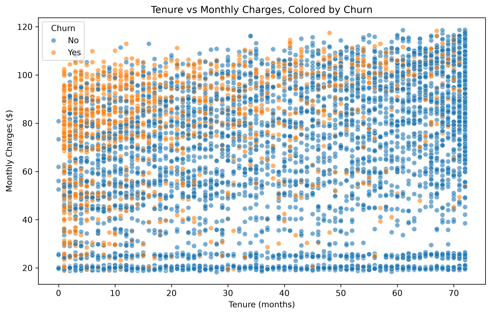
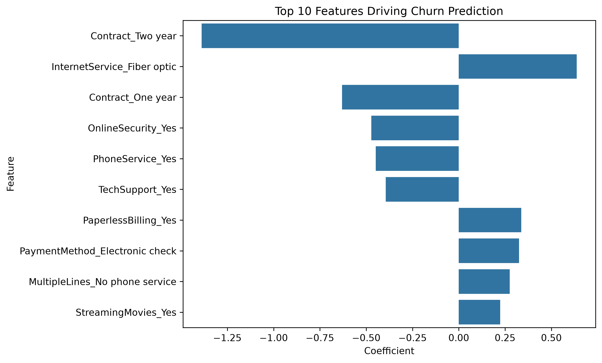
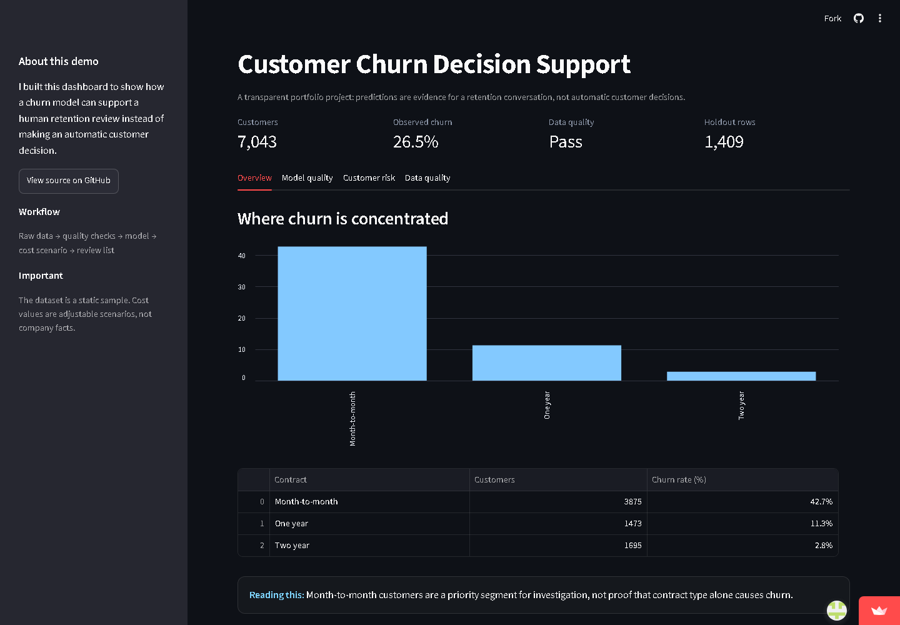

<div align="center">



<a href="https://github.com/Nilesh-builds/customer-churn-analysis">
  
</a>

<br/>


<br/>

<a href="https://nilesh-customer-churn.streamlit.app/">
  
</a>

<br/><br/>

[**Live App**](#-live-app) &nbsp;•&nbsp;
[**Problem**](#-the-problem) &nbsp;•&nbsp;
[**Dataset**](#-dataset) &nbsp;•&nbsp;
[**Workflow**](#-workflow) &nbsp;•&nbsp;
[**Findings**](#-key-findings) &nbsp;•&nbsp;
[**Model**](#-predictive-modeling) &nbsp;•&nbsp;
[**Actions**](#-business-recommendations) &nbsp;•&nbsp;
[**Gallery**](#-visual-gallery) &nbsp;•&nbsp;
[**Run It**](#-how-to-run)

<br/>



</div>

<br/>

> [!IMPORTANT]
> **TL;DR:** Contract type is the strongest churn signal, the first three months are the riskiest, and a class-weighted Random Forest flags **2 in 3** real churners early enough for retention outreach.


## 🌐 Live App

The project is deployed as an interactive **Streamlit** app, so you can explore it in your browser with nothing to install.

<div align="center">

<a href="https://nilesh-customer-churn.streamlit.app/">
  
</a>

</div>

> [!TIP]
> Free Streamlit apps go to sleep when nobody has used them for a while. If you see a "wake up" button, click it and give it a few seconds.

<!--
  ADD AN APP SCREENSHOT OR GIF HERE, for example saved as outputs/app-demo.gif:
  <div align="center"></div>
-->


## 🎯 The Problem

Acquiring a new customer costs **5–25× more** than keeping one, yet most businesses only measure churn *after* the customer has already gone.

This project treats churn as something that can be **anticipated**: using historical customer data to find **who is at risk, why, and what intervention is likely to work.**

<div align="center">


```mermaid
flowchart LR
    Q["❓ Who is most likely<br/>to churn?"] --> W["🔎 Why do<br/>they leave?"] --> A["🛟 What can we do<br/>BEFORE they leave?"]
    classDef q fill:#0d1326,stroke:#22d3ee,stroke-width:2px,color:#ffffff;
    class Q,W,A q;
```

</div>


## 📊 Dataset

<table>
  <tr>
    <td width="50%" valign="top">
      <h4>📦 Source</h4>
      <a href="https://www.kaggle.com/datasets/blastchar/telco-customer-churn">Telco Customer Churn</a> (IBM sample dataset via Kaggle)
    </td>
    <td width="50%" valign="top">
      <h4>📐 Size</h4>
      7,043 customers · 21 raw features<br/>
      Target: <code>Churn</code> (Yes / No)
    </td>
  </tr>
  <tr>
    <td colspan="2">
      <h4>🧩 Feature groups</h4>
      Demographics &nbsp;·&nbsp; Account tenure &amp; billing &nbsp;·&nbsp; Subscribed services &nbsp;·&nbsp; Contract terms
    </td>
  </tr>
</table>

The data is **imbalanced**: only about 1 in 4 customers churns, which is why accuracy alone is a misleading score here.

<div align="center">


```mermaid
pie showData title Class balance (approx.)
    "Retained" : 73
    "Churned" : 27
```

</div>


## 🔬 Workflow



<details>
<summary><b>👉 What happens in each stage</b></summary>

<br/>

| # | Stage | What was done |
|:-:|-------|---------------|
| 1 | **Data Cleaning** | Fixed a hidden type error in `TotalCharges` (stored as text because of blank values for new customers), removed non-predictive identifiers, checked for nulls and duplicates. |
| 2 | **Exploratory Analysis** | Investigated churn across contract type, tenure, pricing and service type to surface the main drivers. |
| 3 | **Risk Segmentation** | Built a rule-based score from the EDA findings to bucket customers into High / Medium / Low risk, then validated it against actual churn. |
| 4 | **Predictive Modeling** | Benchmarked Logistic Regression against Random Forest (default and class-weighted), choosing by the business cost of false negatives, not accuracy. |
| 5 | **Business Translation** | Turned statistical findings into prioritized retention strategies. |
| 6 | **Dashboarding** | Exported model outputs to Power BI for self-serve exploration. |

</details>


## 🔑 Key Findings

<div align="center">


```mermaid
xychart-beta
    title "Churn rate by contract type (%)"
    x-axis ["Month-to-month", "One year", "Two year"]
    y-axis "Churn rate (%)" 0 --> 50
    bar [42.7, 11.3, 2.8]
```

</div>

<table>
  <tr>
    <td width="33%" valign="top">
      <h3>1️⃣ Contract is king</h3>
      Month-to-month <b>42.7%</b> · One-year <b>11.3%</b> · Two-year <b>2.8%</b>
    </td>
    <td width="33%" valign="top">
      <h3>2️⃣ Risk is front-loaded</h3>
      Attrition is concentrated in tenure <b>0–3 months</b>, then drops sharply.
    </td>
    <td width="33%" valign="top">
      <h3>3️⃣ Premium ≠ loyal</h3>
      Fiber optic customers churn <b>2×+</b> more than DSL despite paying more.
    </td>
  </tr>
  <tr>
    <td colspan="2" valign="top">
      <h3>4️⃣ Add-ons correlate with retention</h3>
      Customers with Online Security / Tech Support churn less, likely reflecting deeper product engagement.
    </td>
    <td valign="top">
      <h3>5️⃣ Segments work</h3>
      High-risk: <b>51.7%</b> actual churn vs <b>3.6%</b> for Low-risk, a <b>14×</b> separation.
    </td>
  </tr>
</table>


## 🤖 Predictive Modeling

Three model setups were trained and compared on the **same held-out 20% test set**, so the comparison is fair.

| Model | Accuracy | Precision | Recall | F1 |
|-------|:-------:|:---------:|:------:|:--:|
| Logistic Regression | 82.2% | 68.7% | 60.1% | 64.1% |
| Random Forest (default) | 78.5% | 63.7% | 43.7% | 51.8% |
| **Random Forest (`class_weight='balanced'`)** ✅ | 78.9% | 59.2% | **65.4%** | 62.2% |



### 🧠 Why recall, not accuracy?

Because ~73% of customers stay, a lazy model that predicts "nobody churns" would score ~73% accuracy while catching **zero** churners. What matters is the cost of each mistake:

<div align="center">


```mermaid
flowchart LR
    M["❌ Missed churner<br/>(false negative)"] --> MC["💸 Lost customer<br/>+ lost revenue"]
    F["⚠️ False alarm<br/>(false positive)"] --> FC["🎁 One unnecessary<br/>retention offer"]
    classDef bad fill:#5c1f2b,stroke:#ff5c7a,stroke-width:2px,color:#ffffff;
    classDef ok fill:#1f4d3a,stroke:#3ddc97,stroke-width:2px,color:#ffffff;
    class M,MC bad;
    class F,FC ok;
```

</div>

A missed churner costs far more than a wasted offer, so **recall was the deciding metric** and the class-weighted Random Forest became the production model.

> [!NOTE]
> **Sanity check:** the strongest features in the Logistic Regression coefficients were `Contract_Two year` and `InternetService_Fiber optic`, the same two drivers found by manual EDA. Two independent methods, one story.


## 💡 Business Recommendations

<table>
  <tr>
    <td width="33%" valign="top">
      <h3>🥇 Convert to annual</h3>
      Incentivize month-to-month → annual contracts.<br/><br/>
      <sub><i>Strongest single lever: 15× churn gap</i></sub>
    </td>
    <td width="33%" valign="top">
      <h3>🥈 Onboard early</h3>
      Structured touchpoints at <b>day 30 / day 60</b>.<br/><br/>
      <sub><i>Churn is concentrated in the first 3 months</i></sub>
    </td>
    <td width="33%" valign="top">
      <h3>🥉 Fix Fiber optic</h3>
      Audit pricing, reliability and support.<br/><br/>
      <sub><i>2×+ churn despite premium pricing signals a value gap</i></sub>
    </td>
  </tr>
  <tr>
    <td colspan="2" valign="top">
      <h3>🏅 Bundle protection</h3>
      Include Online Security / Tech Support in new month-to-month plans.<br/><br/>
      <sub><i>Correlated with materially lower churn</i></sub>
    </td>
    <td valign="top">
      <h3>🏅 Score monthly</h3>
      Run the model as a scoring pipeline.<br/><br/>
      <sub><i>Shifts retention from reactive to proactive</i></sub>
    </td>
  </tr>
</table>


## 📈 Visual Gallery

<div align="center">

<table>
  <tr>
    <td align="center" width="50%">
      
      <br/><sub><b>Churn by contract type</b></sub>
    </td>
    <td align="center" width="50%">
      
      <br/><sub><b>Churn by tenure</b></sub>
    </td>
  </tr>
  <tr>
    <td align="center" width="50%">
      
      <br/><sub><b>Risk segments</b></sub>
    </td>
    <td align="center" width="50%">
      
      <br/><sub><b>Feature importance</b></sub>
    </td>
  </tr>
</table>

</div>

> 📊 **Power BI dashboard:** built from `data/telco_churn_with_segments.csv`, which holds the cleaned data plus each customer's risk segment.

<!--
  ADD YOUR DASHBOARD SCREENSHOT HERE once you save it, for example as outputs/dashboard.png:
  <div align="center"></div>
-->


## 🧰 Tech Stack

<div align="center">


</div>

| Category | Tools |
|----------|-------|
| Language | Python 3.x |
| Data wrangling | Pandas, NumPy |
| Visualization | Matplotlib, Seaborn |
| Machine learning | Scikit-learn (Logistic Regression, Random Forest) |
| Dashboarding | Power BI |
| Web app | Streamlit (Streamlit Community Cloud) |
| Environment | Jupyter Notebook |


## 📁 Project Structure

```text
customer-churn-analysis/
├── 📂 assets/                                 # README graphics (animated SVGs)
├── 📂 data/
│   ├── WA_Fn-UseC_-Telco-Customer-Churn.csv   # Raw dataset
│   └── telco_churn_with_segments.csv          # Cleaned data + risk segments (Power BI source)
├── 📂 notebooks/
│   └── customer-churn-analysis.ipynb          # Full analysis: cleaning → EDA → modeling
├── 📂 outputs/
│   ├── churn_by_contract.png
│   ├── churn_by_tenure.png
│   ├── risk_segment_scatter.png
│   └── feature_importance.png
├── 📄 requirements.txt
└── 📄 README.md
```


## 🚀 How to Run

```bash
# 1. Clone the repository
git clone https://github.com/Nilesh-builds/customer-churn-analysis.git
cd customer-churn-analysis

# 2. Install dependencies
pip install -r requirements.txt

# 3. Launch the notebook
jupyter notebook notebooks/customer-churn-analysis.ipynb
```


## 🔭 Limitations & Next Steps

<details open>
<summary><b>What this project does not do (yet)</b></summary>

<br/>

- **Class imbalance (~27% churn)** limits precision when optimizing for recall. SMOTE or threshold tuning could improve the trade-off.
- **Static snapshot data:** the model reflects one point in time, so a real deployment needs periodic retraining.
- **Correlation, not causation:** findings such as the Fiber optic effect are associations. Support tickets and surveys would help find root causes.
- **Next iteration:** add customer lifetime value (CLV) to the risk score so retention spend is prioritized by *both* churn probability and revenue impact.

</details>


## 🙋 About the Author

<div align="center">

**Nilesh Singh** · BCA (Data Science) student building end-to-end analytics projects.

<br/>

[](https://www.linkedin.com/in/nilesh-singh-b9b6932bb/)
[](https://github.com/Nilesh-builds)
[](https://nilesh-builds.github.io/)
[](mailto:kumarnilash509@gmail.com)

<br/>

⭐ **If this project helped you, consider giving it a star!** ⭐


</div>
